## 📁 Project Structure & Architecture

The **IoT Sensor Data Collector** is a FastAPI-based backend designed to receive and store sensor data from IoT devices over HTTP. It provides RESTful APIs to collect, view, and manage sensor readings efficiently.

## 🧩 The Project Goal

#### 1. Receive sensor data(from IoT device like ESP32)
#### 2. Store it in a database
#### 3. Allow retrival for monitoring or analysis

## ⚙️ System Responsibilities

| ***Component*** | ***Responsibility*** |
|----------------|--------------------|
| **IoT Device** | Read data from sensors and send it to the backend via **HTTP** or **MQTT** |
| **Backend (FastAPI app)** | Expose **REST endpoints** to receive and serve sensor data |
| **Database Layer** | Store the collected sensor data |
| **Dashboard / API Client** | Visualize or analyze stored data |

## 📡 Data Flow

```mermaid
flowchart TD
    %% ==== Device Layer ====
    subgraph Device["💡 IoT Device (ESP32)"]
        S1["📟 Read Sensors<br/>(Temperature, Humidity, etc.)"]
        S2["🧩 Format JSON Payload"]
        S3["📤 Send via HTTP POST"]
        S1 --> S2 --> S3
    end

    %% ==== Backend Layer ====
    subgraph Server["⚙️ Backend (FastAPI)"]
        R1["📥 /collect Endpoint"]
        R2["✅ Validate JSON Payload"]
        R3["💾 Insert Data into Database"]
        R4["📡 /data Endpoint for Clients"]
        R1 --> R2 --> R3
    end

    %% ==== Storage Layer ====
    subgraph Storage["🗄️ Database"]
        D1["🕒 Store Timestamped Readings"]
    end

    %% ==== Client Layer ====
    subgraph Client["📈 Dashboard / API Client"]
        C1["🔍 GET /data"]
        C2["📊 Display Readings"]
        C1 --> C2
    end

    %% ==== Connections ====
    S3 --> R1
    R3 --> D1
    D1 --> R4
    R4 --> C1

```

## 🧠 Core Entities

#### The minimal system involves sensors and readings.

### Sensor

| **Field** | **Type** | **Description** |
|------------|----------|-----------------|
| id | int | Unique sensor ID |
| name | string | Human-readable name |
| type | string | e.g. temperature, humidity |
| location | string | Optional (e.g. "Room 1") |

### SensorReading

| **Field** | **Type** | **Description** |
|------------|----------|-----------------|
| id | int | Unique reading ID |
| sensor_id | int | Foreign key to Sensor |
| value | float | Sensor Reading |
| timestamp | datatime | When reading was recorded |

## 🌐 Core Endpoints

| **Method** | **Endpoint** | **Purpose** |
|------------|----------|-----------------|
| **POST** | /collect | IoT device sends sensor data |
| **GET** | /data | Retrieve latest readings |
| **GET** | /data/{sensor_id} | Retrieve data for one sensor |
| **POST** | /register_sensor | (Optional)Register a new sensor |

